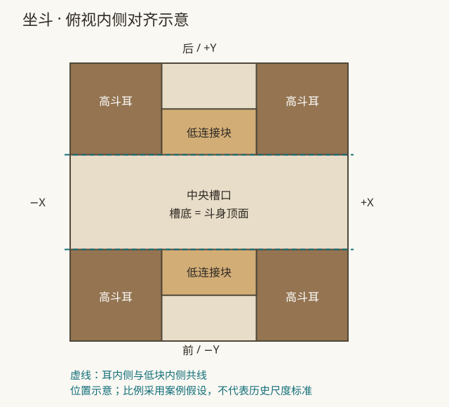

# 中国古建建模 Skills

公开的构件建模案例：从参考图和用户校正中提炼几何关系、GDL 方法与验收依据。
本目录由维护者明确授权共享，按仓库 MIT 许可证发布；案例中的比例不代表某个时代或地区的营造标准。

| 案例 | 适用任务 | 核心经验 |
|---|---|---|
| [坐斗 / chinese-timber-zuodou](skills/chinese-timber-zuodou/SKILL.md) | 建立或修正下部收分、四耳、两条低连接块的坐斗 | RULED 四边棱台；低连接块与斗耳内侧对齐；编译和形状分别验收 |

## 直接使用示例模型

将 [assets/zuodou](skills/chinese-timber-zuodou/assets/zuodou/) 整个 HSF 文件夹复制到自己的工作区，
用 OpenBrep 打开。源文件可编辑，默认外包络为 **396 × 396 × 300 mm**。
模型保留四个斗耳与两条低连接块，低块高度 38 mm、厚度 65.25 mm；这些是案例暂定值。



## 在支持 SKILL.md 的 Agent 中使用

从仓库根目录执行，将整个技能包安装到自己的 Agent 项目中：

```sh
mkdir -p /path/to/agent-project/.agents/skills
cp -R examples/chinese-architecture/skills/chinese-timber-zuodou /path/to/agent-project/.agents/skills/
```

也可以让 Agent 直接读取仓库中的 `SKILL.md`。例如：

```text
使用 chinese-timber-zuodou skill，根据我的参考图修改当前坐斗。
保留下部四边棱台、四个斗耳，两条低连接块与斗耳内侧对齐。
未标注的尺寸先沿用当前参数，并说明采用了哪些假设。
```

## 在 OpenBrep 项目中使用

当前 OpenBrep 的项目 Skill 加载器读取 `.openbrep/skills/*.md`，不递归发现标准 Skill 包。
为目标坐斗项目安装主文件即可获得核心方法与坐标公式：

```sh
mkdir -p /path/to/hsf-project/.openbrep/skills
cp examples/chinese-architecture/skills/chinese-timber-zuodou/SKILL.md /path/to/hsf-project/.openbrep/skills/chinese-timber-zuodou.md
```

重新打开该项目，在指令中提及“坐斗”或 `chinese-timber-zuodou`。
主文件中的相对链接面向完整 Skill 包；仅复制主文件时，详细案例及 HSF 模板请从本仓库读取。
加载器不会自动展开这些附件。安装到项目的 Skill 属于该项目的上下文，适合坐斗项目使用。

## 重新验证示例

在安装了 OpenBrep 开发依赖的仓库根目录运行：

```sh
PYTHONPATH=. python examples/chinese-architecture/skills/chinese-timber-zuodou/scripts/verify_example.py
```

如已安装 Archicad 的 LP_XMLConverter，加 `--compile` 可在临时目录编译。
脚本输出 JSON，核对三组尺寸的连续收分、四耳、内侧连接位置、总尺寸和项目 Skill 加载。
检查范围与结果见 [验证记录](skills/chinese-timber-zuodou/references/verification.md)。

公开案例目录不会自动加入全局生成 prompt，也不是 `openbrep/data/domain_skills/` 的框架执行器包。
是否采用、几何是否符合图纸，仍由具体任务和验收结果决定。

## 案例贡献约定

- 给出明确的构件范围、方向约定和连接关系，区分观察、用户要求与暂定尺寸。
- 带上可编辑的最小示例、修改过程中的反例、实际验证范围。
- 命令文档使用官方出处；参考图片注明来源和发布许可，或用原创几何示意代替。
- 将单个案例的经验限定在其适用条件内，避免把局部比例写成古建通则。
